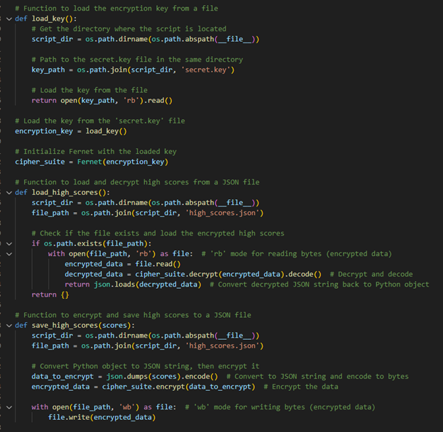

## **Professional Self-Assessment**

	
Throughout my journey in the Computer Science program at Southern New Hampshire University, I have had the opportunity to engage in various projects that have helped me grow as a software developer and expand my technical skill set. By developing this ePortfolio, I have been able to reflect on my progress, showcase my work, and align my strengths with my professional goals in the field of computer science. This assessment serves as an introduction to my portfolio, illustrating how my experiences throughout the program have shaped my career path and prepared me for future opportunities.

Outside of the artifacts which are showcased in my portfolio, there are several projects throughout my time in the Computer Science program which have greatly contributed to my growth as a developer. When I first began this program, I believed that software development was just coding. However, after going through the courses in this program, I have come to realize there is far more to software development than just coding. I gained insight into the collaboration needed in the Software Development Lifecycle (SDLC) as I worked on the final project for CS250 – SDLC. My work in CS-370: Current and Emerging Trends taught me the fundamentals of training machine learning models and introduced a new perspective on identifying areas where artificial intelligence could be applied effectively. My research on AlphaGo Zero was particularly impactful, fundamentally shifting my understanding of the potential applications of AI and machine learning.

Working on these projects has helped me recognize the importance of core computer science topics, such as data structures and algorithms, while highlighting the need for security, efficient software engineering, and effective collaboration in a professional setting. These skills are applicable not only in technical problem-solving but also in real-world scenarios where clear communication and security considerations are critical.

The artifacts included in my portfolio each serve a specific purpose, and together they tell the story of my journey as a developer. From the Rescue Animal Application highlighting my ability to transition between programming languages and adopt industry best practices, to the 3D Scene Rendering showcasing my creativity and problem-solving skills in graphics programming, and the Text-Based Game demonstrating my approach to security-first coding, these projects reflect my range of abilities and commitment to lifelong learning. By reviewing these projects, viewers of my portfolio will be able to see the breadth and depth of my technical expertise and the consistent effort I have put into refining my skills.

Overall, my professional self-assessment and the artifacts in my ePortfolio are a testament to my dedication to becoming a well-rounded computer scientist. They illustrate not only my technical competence but also my growth in collaboration, communication, and security practices. I am confident that the skills I have developed throughout my academic journey have prepared me to contribute effectively to any organization and take on new challenges in the field of computer science.

----------------------------------------------------------------------------------------------------------------------------------------------------------------------------------------------

## **Course Outcomes**

Throughout my ePortfolio within my artifacts and additionally each narrative I showcase a portion of my skills and knowledge including the following outcomes:

  - I employ strategies for building collaborative environments that enable diverse audiences to support organizational decision making in the field of computer science
  - I design, develop, and deliver professional-quality oral, written, and visual communications that are coherent, technically sound, and appropriately adapted to specific audiences and contexts
  - I design and evaluate computing solutions that solve a given problem using algorithmic principles and computer science practices and standards appropriate to its solution, while managing the trade-offs involved in design choices
  - I demonstrate an ability to use well-founded and innovative techniques, skills, and tools in computing practices for the purpose of implementing computer solutions that deliver value and accomplish industry-specific goals
  - I develop a security mindset that anticipates adversarial exploits in software architecture and designs to expose potential vulnerabilities, mitigate design flaws, and ensure privacy and enhanced security of data and resources

----------------------------------------------------------------------------------------------------------------------------------------------------------------------------------------------

## **Informal Code Review**
### Overview:

My code review video goes over all three of the artifacts I have chosen for my ePortfolio. I go over each artifact and identify errors, flaws, vulnerabilities, and other areas for improvement. I review how my code works and explain my planned modifications and enhancements in a manner that is easy to understand, without getting too technical. Throughout the review, I provide professional-quality oral, written, and visual communication techniques to effectively explain a code review through collaborative environments that are coherent, technically sound, and appropriately adapted to specific audiences. My code review focuses on three primary areas:

  - Existing functionality: A detailed walk-through of the existing code focused on the features and function of the current code.
  - Code Analysis: Target areas of improvement in structure, logic, efficiency, functionality, security, testing, commenting, and documenting.
  - Enhancements: A walk-through of planned enhancements that address issues raised in the code analysis.

<iframe-align="center" width="900" height="480" src="https://www.youtube.com/watch?v=St92ioaJhDA" title="YouTube video player" frameborder="0" allow="accelerometer; autoplay; clipboard-write; encrypted-media; gyroscope; picture-in-picture; web-share" allowfullscreen></iframe>

----------------------------------------------------------------------------------------------------------------------------------------------------------------------------------------------
---------------------------------------------------------------------------------------------------------------------------------------------------------------------------------------------- 
## **Artifact 1 Software Engineering and Design**
### Introduction:

The artifact I’ve chosen for my Software Design and Engineering category is my Rescue Animal application. This application is designed to manage Rescue Animals for a fictional company called Grazioso Salvare. The company has two different types of animals it trains to be rescue animals, which are dogs and monkeys. This application serves to keep track of rescue animals and record various attributes about them. This was the final project for the IT-145: Foundation in Application Development course. I took this course in 2022 during my second term at Southern New Hampshire University. 

I chose this artifact because it was one of the first projects I worked on, and it allowed me to showcase how much I have grown throughout my time in the Computer Science program. When I originally worked on this project there was much that I did know about how to make code friendlier to read and understand for others. I’ve also learned more about industry best practices and how to apply them. For my enhancement, I’ve chosen to convert the original Java code to Python. I chose this because Python is the most popular coding language and because it’s the language that we have used the least throughout the Computer Science program. As such I wanted to showcase my versatility by re-writing the application in Python. Finally, using Python provides cleaner, more efficient code that is also easier to read than Java for this project. 

  - [Original Build Files](https://github.com/patel-sheel/patel-sheel.github.io/tree/main/Software%20Design%20and%20Engineering/IT145_RescueAnimal_Original) (View the directory containing the original Java code)
  - [Final Build Files](https://github.com/patel-sheel/patel-sheel.github.io/tree/main/Software%20Design%20and%20Engineering/IT145_RescueAnimal_Enhancement) (View the directory containing the final Python code)
    

    
    
<em>Figure 1 - Original Java Code</em>

    
    
<em>Figure 1 - Enhanced Python Code</em>

### Conclusion:

In comparing the examples above we can see that the Python code is much more concise and does not require explicit type declarations and setters and getters are not necessary unless they are needed for encapsulation. The code is also less verbose making it easier to maintain a project of this size. Moving from Python to Java is not the only enhancement made to the code though. One such enhancement is that I’ve added error handling for situations in which the user enters an invalid number for age. I’ve also streamlined the code by condensing repetitive lines. I did this by using a single function to collect data on attributes that are common to both dogs and monkeys. Finally, I added better comments to my code to make it easier for those looking at it for the first time to understand what is being done. 

The changes I have made and documentation I have provided directly apply to a couple of the course outcomes. Specifically, the professional documentation and code review I have provided clearly communicate the purpose of the code and how it functions. The addition of input validation and error handling makes the application easier to use for a wider audience as they will not be stuck dealing with crashes or errors. Additionally, by moving to Python and providing better comments, it has been made easier to collaborate with developers of varying skill levels. Finally, creating different classes makes it easier for various team members to understand on work on specific parts of the code. This creates a more collaborative environment that allows for contributions from a more diverse audience. 

As I went through the process of converting the code from Java to Python, there were some lessons I learned and some challenges which I faced. I learned the importance of future proofing and writing for collaboration as I read through the old code and the comments I had made. I realized that 2 years later, the comments weren’t as obvious as I once thought. I gained a better understanding of the importance of input validation and error handling as I tested the old code and saw the different issues which existed. Finally, I learned how powerful Python is while being so simple to write. It allows developers to focus more on what they are trying to do rather than focusing on avoiding syntactical errors that could cost them hours locating later during debugging. As I mentioned, I also faced some challenges when rewriting the code from Java to Python. I have some experience with Python but I had not created a multi-class python script so I had to do some research on how that could be done. There was also a lot of syntax that I didn’t know which led to me doing a lot of research to find out how something done in Java is done in Python. I started by creating the code in Python almost line for line. I then went back and reviewed it to determine how I could make it more efficient and add more enhancements. Looking back on it, I could have done a better job in the planning stage of adding the additional enhancements and removing redundancies. However, not doing so provided me with an opportunity to further exercise my ability to write code in Python, so it was not a complete loss. Facing these challenges allowed me to learn a great deal and I believe I am a better developer for having gone through them. 

----------------------------------------------------------------------------------------------------------------------------------------------------------------------------------------------
## **Artifact 2 Algorithms and Data Structures**
### Introduction:

The artifact I’ve chosen for my Algorithms and Data Structures category is my 3D rendering of a 2D scene. The goal of the project was to select a 2D scene and recreate it in 3D using OpenGL. The scene I chose is from the Super Nintendo game Yoshi’s Island. This was the final project for the CS-330: Computational Graphics and Visualization course. I took this course during the summer of 2024 at Southern New Hampshire University.

I chose this artifact because it was one of the projects I most enjoyed during my time in the Computer Science program. I also chose it because I work on GPUs so I found this project especially interesting. Although I took this course recently, I have still though of way I can improve on the original code already. For my enhancement, I have chosen to convert some of the previous code I had written for creating objects into separate functions that can be used to repeatedly create objects. I’ve also added additional objects and created functions for adding them into the scene. As you’ll see in the original scene vs the enhanced scene, there are many objects in the scene which are repetitive. As such it is ideal to create a function which can be used to create those objects. Understanding how and when to do is very important to my development as a software developer. Creating functions for repetitive code means our code will be cleaner, more efficient, and take less time to develop or adjust.

  - [Original Build Files](https://github.com/patel-sheel/patel-sheel.github.io/tree/main/Algorithms%20and%20Data%20Structures/CS330_3D_Scene_Original) (View the directory containing the original project files.)
  - [Original Build Code](Algorithms and Data Structures\CS330_3D_Scene_Original\CS330_3D_Scene_Original\Source\SceneManager.cpp) (View the original code here.)
  - [Final Build Files](https://github.com/patel-sheel/patel-sheel.github.io/tree/main/Algorithms%20and%20Data%20Structures/CS330_3D_Scene_Enhanced) (View the directory containing the final project files.)
  - [Final Build Code](Algorithms and Data Structures\CS330_3D_Scene_Enhanced\CS330_3D_Scene_Enhancement\Source\SceneManager.cpp) (View the final code here.)

    
    
<em>Figure 3 - The 2D scene from Yoshi's Island which I attempted to recreate in 3D</em>

    
    
<em>Figure 4 - Original 3D Scene</em>

    
    
<em>Figure 5 - Enhanced 3D Scene</em>

    
    
<em>Figure 6 - Function for creating platforms</em>

    
    
<em>Figure 7 - Function calls used to create scene</em>

### Conclusion:

In comparing the examples above its obvious that a significant number of additions were added to the scene to bring it to be closer to the scene it is attempting to recreate. In the enhanced scene there are several small objects that it would be tedious to recreate and position constantly. It also makes it difficult to read through the code and identify which object you are looking at. Therefore, it is extremely beneficial to try to condense as much of the code as possible by turning any code that is repetitive into a function which can be used to create the objects. In the coding example provided of the enhanced code, the code for creating the platforms in the scene has been turned into its own function which is passed an x, y, and z location to determine the position of the platform. The second code example shows how that function, among others, are called in the scene rendering function. The cleaned-up code allows for changes to platform textures, sizing, and other values to be changed in the function to adjust all the platforms. This leads to a more streamlined code that is easier to read and work in.  

The changes I have made apply to a couple of the course outcomes. My use of a function to reduce repetitive code and make it more streamlined and easier to read achieves the developing of a solution that solves a problem by using computer science practices. Additionally, by implementing these functions in a variety of way such as the coins taking in how many columns and rows of coins there should be or the tree creation taking in the zrotation to be able to angle the trees on the hills. This demonstrates my ability to use well-founded and innovative techniques to implement computer solutions. 

As I went through the process of enhancing my scene render to more of the scene by using functions to reduce repetitive code, I faced some challenges and learned some lessons. I learned how important it is to reduce repetitive code as I tried to look through my old code. The old code had so many lines that it made it difficult to keep track of what I was looking at and working on. I also had some difficulty with creating the function for creating coins as I needed to leave every other space empty. As I worked on determining what functions should be created and how, my main consideration was what objects were used multiple times and how to easily keep complex shapes together. With this in mind, I began to create my various functions. Getting the coin creation correct took a little bit of trial and error, but it was far easier than creating each individual coin on its own. I also had to make different functions for the different types of mountains in the scene because angling the trees was a bit tricky. Overall, creating the different functions and fleshing out the scene was enjoyable as it cleaned up the original code, made it easier to read, and further in line with best practices.

----------------------------------------------------------------------------------------------------------------------------------------------------------------------------------------------
## **Artifact 3 Databases**
### Introduction:

The artifact I’ve chosen for my Databases category is the text-based game which I wrote in Python. The premise of the project was to create an application in which the user was required to obtain a number of items before being able to enter the final room. This was the final project for the IT-140: Intro to Scripting course. I took this course during my first term in 2022 at Southern New Hampshire University.

I chose this artifact because it was the very first code that I wrote. I thought it would be another good showcase of how I have evolved as a developer. When I first wrote this code, I was only thinking about the end goal and put no consideration into things like security. For my enhancement, I have chosen to add a database for storing high scores. The original game didn’t have a scoring system, so I also had to add that. Additionally, due to storing the high scores in a json file, I added encryption and decryption using a key, so the scores are safely stored. This also required the creation of a main menu so user could navigate to the high scores or to the game. The high scores themselves are calculated as the time left after the user has won the game. 

  - [Original Build Files]() (View the directory containing the original project files.)
  - [Original Build Code]() (View the original code here.)
  - [Final Build Files]() (View the directory containing the final project files.)
  - [Final Build Code]() (View the final code here.)

    
    
<em>Figure 8 - Enhanced Python code with encryption and decryption for high score file</em>

### Conclusion:

The code displayed above shows how the high score database and encryption has been implemented. The code uses a key that I created to encrypt and decrypt the high scores. The high scores are stored in a json file because I found this to be the best solution for a game of this type and scale. If I were to put this game online, I might use MongoDB instead. When I was implementing these changes, I had some difficulties. I initially overcomplicated the scoring system and time system by trying to create a more elaborate score. However, after stepping away and coming back to the code, I realized that I could take the simpler approach of using the time remaining as the score. Another issue I ran into was the save location for the high scores json and secret key. The files were originally being stored and looked for in the windows user directory so, I had to add some additional logic to store the files in the same directory as the python script. If I were to publish this game, I might change the location where the files are stored to a more hidden location so they can’t be tampered with. Finally, the most difficult addition to my code was adding the encryption and decryption for the high score json. As I mentioned before, I had trouble with where the files were stored. In addition to this, I had not implemented encryption and decryption in Python so I had to research how this worked. The method I used in the code above is the best and simplest method which I found. 

The changes I implemented in my enhancement directly apply to the course outcome regarding approaching coding with a security first mindset. I believe I did good job of this by implementing encryption and decryption of the high scores. Additionally, because I used a json file to store the scores rather than a SQL database, I didn’t have to implement SQL injection prevention. Overall, the adjustments made to the original code created a game that was more robust and secure. 

----------------------------------------------------------------------------------------------------------------------------------------------------------------------------------------------